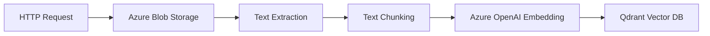

# RAG Embedding Generation Function

A serverless Azure Function that processes documents from Azure Blob Storage, extracts text, generates embeddings using Azure OpenAI, and stores them in Qdrant for Retrieval Augmented Generation (RAG) systems.

---

## 🚀 Features

- **Document Processing**: Supports PDF, Excel (XLSX/XLS), CSV, TXT, HTML, images (OCR), Python, and SQL files.
- **Azure Integration**: Reads from Azure Blob Storage, uses Azure OpenAI for embeddings.
- **Vector Storage**: Stores embeddings in Qdrant vector database.
- **Batch & Single Processing**: Accepts one or multiple blob URLs per request.
- **REST API**: HTTP-triggered Azure Function.
- **Configurable Chunking**: Adjustable chunk size and overlap.
- \*\*Robust Logging & Error Handling.
- **Environment Variable Support**: Easily configure secrets and runtime options via environment variables.

---

## 🏗️ Architecture



---

## 🛠️ Prerequisites

- Python 3.8+
- Azure Subscription
- Azure Storage Account
- Azure OpenAI Resource
- Qdrant Instance
- Azure Functions Core Tools

---

## 📦 Installation

```bash
git clone <repository-url>
cd rag_embedding_generation_function
python -m venv venv
source venv/bin/activate  # Windows: venv\Scripts\activate
pip install -r requirements.txt
```

---

## ⚙️ Configuration

Create `local.settings.json` for local development:

```json
{
  "IsEncrypted": false,
  "Values": {
    "AzureWebJobsStorage": "<your-storage-connection-string>",
    "FUNCTIONS_WORKER_RUNTIME": "python",
    "AZURE_OPENAI_API_KEY": "<your-openai-api-key>",
    "AZURE_OPENAI_DEPLOYMENT": "text-embedding-3-large",
    "AZURE_OPENAI_TEXTEMBEDDER_API_VERSION": "2023-05-15",
    "AZURE_OPENAI_TEXTEMBEDDER_ENDPOINT": "https://<your-openai-resource>.openai.azure.com/",
    "QDRANT_COLLECTION": "default_collection",
    "QDRANT_URL": "https://<your-qdrant-instance>.qdrant.io",
    "QDRANT_API_KEY": "<your-qdrant-api-key>",
    "CHUNK_SIZE": "1000",
    "CHUNK_OVERLAP": "200",
    "LOG_LEVEL": "INFO",
    "ENABLE_OCR": "true",
    "PYTESSERACT_PATH": "/usr/bin/tesseract"
  }
}
```

**Newly added environment variables:**

- `CHUNK_SIZE`: Number of characters per text chunk (default: 1000).
- `CHUNK_OVERLAP`: Overlap between chunks (default: 200).
- `LOG_LEVEL`: Logging verbosity (e.g., INFO, DEBUG).
- `ENABLE_OCR`: Set to `"true"` to enable OCR for images.
- `PYTESSERACT_PATH`: Path to the Tesseract binary for OCR.

For production, set these in Azure Function App Configuration.

---

## 🏃 Running Locally

```bash
func start
```

API available at: `http://localhost:7071/api/rag_embedding_generation_text_extraction`

---

## 📝 Usage

### API Request

**Single document:**

```bash
curl -X POST "http://localhost:7071/api/rag_embedding_generation_file_upload" \
  -F "file=@customers-1000.csv" \
  -F "user_id=f85c7d6b-7a64-4b13-b8b7-5a458b0ff7ad" \
  -F "chat_id=b04391b3-06a4-4277-be1e-820034e6f03c"

curl -X POST "http://localhost:7071/api/rag_embedding_generation_file_upload" \
  -F "file=@sample3.txt" \
  -F "user_id=f85c7d6b-7a64-4b13-b8b7-5a458b0ff7ad" \
  -F "chat_id=b04391b3-06a4-4277-be1e-820034e6f03c"
```

**Batch:**

```bash
curl -X POST "http://localhost:7071/api/rag_embedding_generation_file_upload" \
  -F "file=@customers-1000.csv" \
  -F "file=@sample3.txt" \
  -F "user_id=f85c7d6b-7a64-4b13-b8b7-5a458b0ff7ad" \
  -F "chat_id=b04391b3-06a4-4277-be1e-820034e6f03c"
```

### Response

```json
{
  "results": [
    {
      "message": "Blob processed successfully",
      "filename": "document.pdf",
      "blob_url": "...",
      "chunks_count": 15,
      "first_chunk_preview": "This is the beginning of the document..."
    }
  ]
}
```

---

## 🔐 Authentication

- **SAS Token**: Include in blob URL (recommended for direct API use).
- **Managed Identity**: Enable on Function App, grant Storage Blob Data Reader, update code to use `DefaultAzureCredential`.
- **Connection String**: Use storage account connection string in settings.

---

## 📤 Deploying to Azure

1. **Create Function App:**
   ```bash
   az functionapp create --resource-group <ResourceGroup> --consumption-plan-location <region> \
     --runtime python --runtime-version 3.9 --functions-version 4 \
     --name <FunctionAppName> --storage-account <StorageAccountName>
   ```
2. **Deploy:**
   ```bash
   func azure functionapp publish <FunctionAppName>
   ```
3. **Configure Settings:**
   ```bash
   az functionapp config appsettings set --name <FunctionAppName> --resource-group <ResourceGroup> \
     --settings "AZURE_OPENAI_API_KEY=..." "AZURE_OPENAI_DEPLOYMENT=..." ...
   ```

---

## ⚠️ Troubleshooting

- **Auth Errors**: Check SAS token, managed identity permissions, or connection string.
- **Extraction Issues**: Verify file format, dependencies (e.g., pytesseract), and encoding.
- **Qdrant Errors**: Check URL, API key, collection existence, and network.
- **OCR Issues**: Ensure `ENABLE_OCR` is set to `"true"` and `PYTESSERACT_PATH` is correct.

---

## 📁 File Structure

```
rag_embedding_generation_function/
├── function_app.py
├── requirements.txt
├── host.json
├── local.settings.json
└── README.md
```

---

## 🤝 Contributing

Contributions welcome! Open issues or submit PRs.

---

## 📚 References

- [Azure Functions Documentation](https://docs.microsoft.com/azure/azure-functions/)
- [Azure OpenAI Service](https://learn.microsoft.com/azure/cognitive-services/openai/)
- [Qdrant Documentation](https://qdrant.tech/documentation/)
- [Azure Blob Storage](https://docs.microsoft.com/azure/storage/blobs/)
- [PyMuPDF](https://pymupdf.readthedocs.io/)
- [pytesseract](https://pypi.org/project/pytesseract/)
